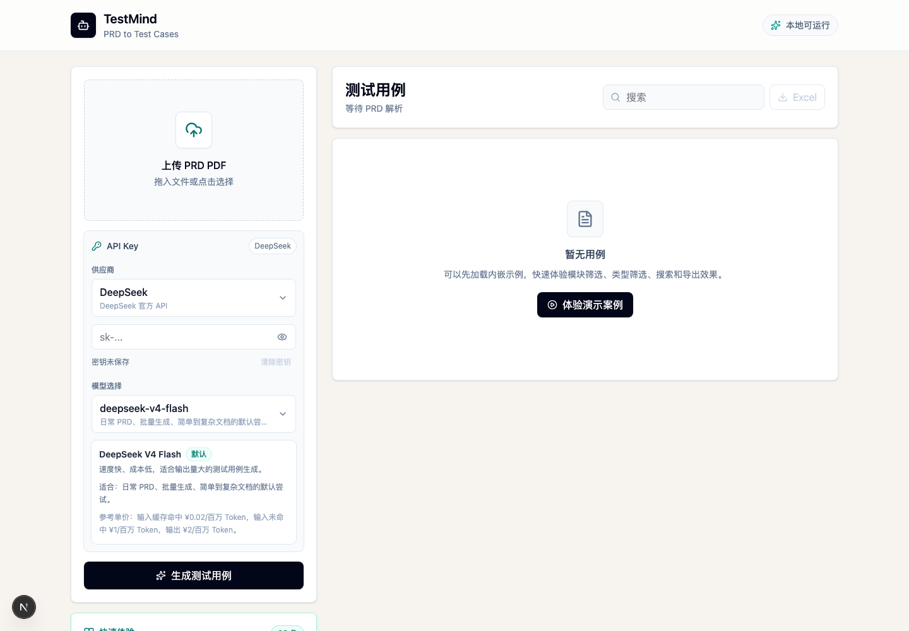
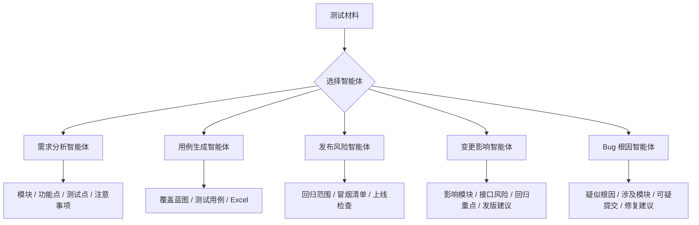
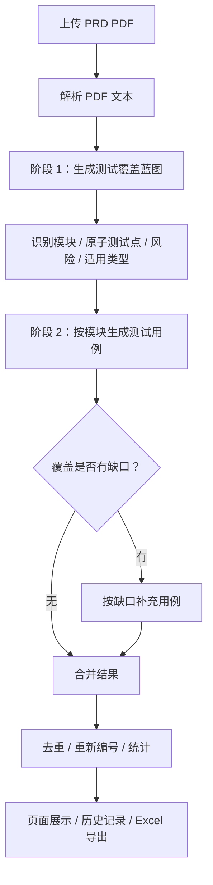

# TestMind

> AI testing agent workbench for a solo QA workflow. It keeps the original PRD-to-test-case generator, and adds lightweight agents for requirement test-point analysis, release risk, change impact, and Bug root-cause analysis.


## 项目定位

TestMind 正在从单一的“PRD 转测试用例平台”收敛为面向唯一测试的 AI 测试智能体工作台。它不替代 PingCode 这类用例资产管理平台，而是放在测试设计、发版检查和用例导入前，帮助测试把重复的分析工作流程化。

当前工作台包含 5 个智能体：

1. 需求分析智能体：上传 PRD PDF，按模块提取功能点、测试点和测试过程中的注意事项。
2. 用例生成智能体：保留原有 PRD PDF 解析、覆盖蓝图、分模块生成、缺口补充、Excel 导出的完整链路。
3. 发布风险智能体：粘贴发布说明、需求变更、Bug 列表、接口变更或 Git diff，输出回归范围、发布风险、冒烟清单和上线检查项。
4. 变更影响智能体：粘贴 git diff、PR 描述或提交记录，输出影响模块、受影响功能、接口风险、重点回归和是否建议阻止发版。
5. Bug 根因智能体：粘贴或上传 stacktrace、error log、request、git diff、commit 信息，并可上传协议/接口规范作为依据文档，输出疑似根因、涉及模块、可疑提交、相似历史 Bug 和修复建议。

其中用例生成智能体不是简单把 PRD “总结成几条用例”，而是尽量模拟真实测试设计流程：

1. 先从 PRD 中识别业务模块、用户角色、流程、字段、状态、规则和风险。
2. 再生成测试覆盖蓝图，判断哪些测试类型适用、每个测试点预计需要多少用例。
3. 然后按模块分批生成测试用例，降低一次性超长 JSON 输出导致的截断、丢失和解析失败。
4. 最后做覆盖缺口补充、去重、编号、统计和 Excel 导出。

适合用在需求拆解、测试方案设计、回归用例补充、复杂 PRD 覆盖审计、发布风险检查和测试交付物整理等场景。

## 系统预览



## 核心能力

| 能力 | 说明 |
| --- | --- |
| 智能体工作台 | 首页顶部可切换需求分析、用例生成、发布风险、变更影响和 Bug 根因智能体 |
| 需求分析 | 上传 PRD PDF，按模块输出功能点、测试点、注意事项、检查清单和下一步 |
| 需求分析详情页 | 首页展示需求分析概览，点击进入二级页面按模块目录、优先级、搜索和分页查看全部测试点 |
| 发布风险 | 粘贴发布材料，输出回归范围、P0/P1 风险、冒烟清单和上线检查项 |
| 变更影响 | 粘贴 git diff / PR，输出影响模块、接口破坏风险、重点回归和发版建议 |
| Bug 根因 | 粘贴或上传日志、堆栈、请求、diff 和依据文档，输出疑似根因、涉及模块、可疑提交和修复建议 |
| 分析文件上传 | 发布风险、变更影响和 Bug 根因支持主材料文件与依据文档，支持 PDF、日志、Markdown、JSON、HAR、diff、patch 和常见文本文件 |
| 设置页 | 供应商、API Key、模型、推理等级和 Velotric 网关统一在 `/settings` 配置 |
| 分析过程可视化 | 需求分析、发布风险、变更影响和 Bug 根因分析支持过程弹窗，展示当前阶段、运行时间、模型实时输出和停止按钮 |
| PRD PDF 上传 | 支持上传 PDF 需求文档并提取文本内容 |
| 覆盖蓝图 | 先拆解模块、测试点、风险、适用类型和预计用例数量 |
| 测试点详情页 | 首页展示报告概览，点击进入二级页面按模块目录、类型、搜索和分页查看全部测试点 |
| 自适应用例数量 | 简单 PRD 不硬凑，复杂 PRD 不漏测，数量由测试点和风险决定 |
| 模块化生成 | 按功能模块逐步生成，避免一次性长 JSON 失败 |
| 逆向用例补充 | 功能类不仅覆盖成功路径，也补充失败、取消、重复提交、状态不满足等路径 |
| 多模型供应商 | 支持 DeepSeek、阿里云百炼、OpenAI 官方、Velotric 公司号池 |
| 推理等级 | OpenAI / Velotric 支持低、中、高、超高推理等级配置 |
| 生成过程弹窗 | 显示阶段日志、模型实时输出、空闲提示、已接收字符数和停止按钮 |
| 失败运行日志 | 失败阶段、供应商、模型、错误原文、耗时、token、最后一次事件写入 SQLite |
| 运行结果历史 | 成功、失败、停止的运行记录都可在历史页查看 |
| Excel 导出 | 按导入模板输出 `.xlsx`，包含模块、编号、标题、维护人、重要程度、步骤、预期结果等字段 |
| 内嵌演示案例 | 不上传 PDF、不填 API Key 也能一键体验平台效果 |

## 智能体工作台



需求分析智能体只支持 PRD PDF 上传；发布风险、变更影响和 Bug 根因智能体支持文本输入、主材料文件和依据文档，其中 Bug 根因智能体默认以文件上传为主，不再显示“Bug 现场材料”文本框。长日志或长协议文档会自动保留开头、关键错误/接口/diff/协议片段和结尾，不再因为超过 80000 字符直接失败。四个分析类智能体都支持无 API Key 的本地规则兜底；配置 DeepSeek、阿里云百炼、OpenAI 或 Velotric Key 后会调用模型生成结构化报告。

## AI 生成流程



## 覆盖策略

TestMind 当前采用“覆盖蓝图优先”的生成策略。

### 1. PRD 解析阶段

平台会先提取 PDF 文本，并将 PRD 内容传给模型进行模块识别。模型需要判断：

- 整体复杂度：极简、简单、中等、复杂、大型
- 一级模块、子模块、页面、接口、流程、任务
- 用户角色、业务对象、字段规则、参数范围
- 状态机、业务规则、通知、报表、导入导出、第三方集成
- 权限、安全、审计、异常、性能相关能力

### 2. 测试点拆解阶段

系统要求模型将需求拆成“原子测试点”，例如：

- 登录成功
- 错误密码
- 未注册账号
- 验证码过期
- 账号锁定
- 重复点击提交
- 接口超时

用例数量由这些原子测试点、风险等级和适用测试类型决定，而不是固定每个模块必须生成同样数量。

### 3. 类型适用判断

| 测试类型 | 生成条件 |
| --- | --- |
| 功能 | 大多数显式需求都需要覆盖，包含正向和主要逆向路径 |
| 边界 | 字段、数量、金额、时间、范围、枚举、分页、阈值等规则存在时重点生成 |
| 异常 | 接口失败、网络失败、依赖失败、超时、中断、同步失败等场景存在时生成 |
| 权限 | 登录态、角色、会员等级、数据隔离、越权、敏感数据等风险存在时生成 |
| 性能 | 高频操作、大数据量、并发、响应时限、批量处理等要求存在时生成 |

没有 PRD 依据的类型不会为了凑数量强行生成。

### 4. 覆盖补充阶段

生成完每个模块后，后端会检查：

- 显式测试点是否被覆盖
- 功能类是否只有 happy path
- 关键流程是否有正向和逆向
- 字段规则是否覆盖合法、非法、边界
- 角色和权限差异是否覆盖
- 异常和性能风险是否遗漏

如果发现缺口，会针对缺口再次调用模型补充用例。

## 模型供应商

| 供应商 | 默认模型 | 说明 |
| --- | --- | --- |
| DeepSeek | `deepseek-v4-flash` | 成本低、速度快，适合批量生成 |
| 阿里云百炼 | `qwen-plus` | 支持快速 / 高质量模式，适合国内网络和 Qwen 系列模型 |
| OpenAI 官方 | `gpt-5.4-mini` | 支持 GPT 模型和推理等级 |
| Velotric 号池 | `gpt-5.4` | 公司 OpenAI 兼容网关，默认地址为 `https://api-ai.velotric.net` |

OpenAI / Velotric 支持推理等级：

| 推理等级 | 适合场景 |
| --- | --- |
| 低 | 快速试跑、简单 PRD、成本优先 |
| 中 | 日常默认，速度和质量均衡 |
| 高 | 复杂 PRD、正式生成、覆盖要求较高 |
| 超高 | 关键业务、最终审查；更慢、更贵，且取决于模型和网关权限 |

阿里云百炼支持生成模式：

- 快速模式：关闭思考，首包更快，停顿更少
- 高质量模式：开启思考，覆盖更稳，但等待更久、费用更高

## 快速开始

### 1. 安装依赖

```bash
npm install
```

### 2. 启动开发服务

```bash
npm run dev
```

默认访问：

```text
http://127.0.0.1:3000
```

### 3. 生产构建

```bash
npm run build
npm run start
```

### 4. 代码检查

```bash
npm run lint
```

## API Key 配置

TestMind 支持两种 Key 配置方式。

### 方式一：网页填写

在 `/settings` 设置页选择供应商，填写 API Key、模型和模式。首页只显示当前模型摘要和设置入口。

特点：

- 适合本地使用和调试
- 每个供应商独立保存 Key
- 刷新页面后仍保留在浏览器本地存储
- 不会写入仓库文件

### 方式二：环境变量

复制 `.env.example`：

```bash
cp .env.example .env.local
```

示例：

```bash
OPENAI_API_KEY=
OPENAI_MODEL=gpt-5.4-mini

DEEPSEEK_API_KEY=
DEEPSEEK_MODEL=deepseek-v4-flash

DASHSCOPE_API_KEY=
DASHSCOPE_MODEL=qwen-plus
DASHSCOPE_BASE_URL=https://dashscope.aliyuncs.com/compatible-mode/v1

VELOTRIC_API_KEY=
VELOTRIC_MODEL=gpt-5.4
VELOTRIC_BASE_URL=https://api-ai.velotric.net
```

> 注意：`VELOTRIC_API_KEY` 是公司号池 Key，通常形如 `sk-velotric-xxx`。不要把公司 Key 填到 OpenAI 官方供应商里，否则会出现 `401 Incorrect API key`。

## 使用流程

### 一键体验

如果只是想快速看效果，可以直接点击首页的“体验演示案例”。该模式不需要上传 PDF，也不需要填写 API Key。

可以体验：

- 模块筛选
- 类型筛选
- 搜索
- 覆盖蓝图展示
- Excel 导出

### 真实 PRD 生成

1. 打开 TestMind。
2. 进入设置页选择供应商和模型。
3. 填写 API Key 后返回工作台。
4. 上传 PRD PDF。
5. 点击“生成测试用例”。
6. 在弹窗中观察生成过程。
7. 如需终止，点击“停止运行”。
8. 生成完成后按模块查看测试用例。
9. 点击 Excel 导出。
10. 在运行记录页面查看历史结果、失败日志和统计信息。

## Excel 输出

导出的 `.xlsx` 会对齐测试用例导入模板，工作表名称为 `test_case`。

主要字段包括：

| 字段 | 说明 |
| --- | --- |
| 模块 | 完整模块路径，支持多级模块 |
| 编号 | 用例编号，例如 `TC-001` |
| 标题 | 必填，用例标题 |
| 状态 | 可为空 |
| 维护人 | 默认 `杨思伟` |
| 用例类型 | 功能测试、性能测试、安全相关、接口测试等 |
| 重要程度 | P0 / P1 / P2 |
| 测试类型 | 当前固定为手动 |
| 预估工时 / 剩余工时 | 可为空 |
| 关联工作项 | 多个需求编号用 `|` 分隔 |
| 前置条件 | 用例执行前置条件 |
| 步骤描述 | 自动编号，支持多步骤换行 |
| 预期结果 | 与步骤对应的预期结果 |
| 关注人 | 默认同维护人 |
| 备注 | 测试分类、测试点、PRD 依据等 |

单次导出最多支持 5000 条用例。

## 运行记录与日志

运行记录持久化在本地 SQLite：

```text
data/testmind.sqlite
```

该文件已被 `.gitignore` 忽略，不会提交到仓库。

运行记录包含：

- 运行状态：成功、失败、已停止
- 文件名
- 供应商、模型、推理等级 / 生成模式
- 耗时
- Token 使用量
- 估算费用
- 模块数量和用例数量
- 失败阶段
- 错误原文
- 最后一次事件
- 失败前已生成的部分用例

这意味着即使模型在 20 分钟后失败，也不会完全丢失现场。

## 目录结构

```text
.
├── docs
│   ├── images
│   │   └── testmind-home.png
│   ├── demo-prd-login-only.md
│   └── demo-prd-login-only.pdf
├── src
│   ├── app
│   │   ├── api
│   │   │   ├── export/excel/route.ts
│   │   │   ├── generate/route.ts
│   │   │   ├── generate/stream/route.ts
│   │   │   └── run-history/route.ts
│   │   ├── history/page.tsx
│   │   ├── layout.tsx
│   │   └── page.tsx
│   ├── lib
│   │   ├── download-excel.ts
│   │   ├── model-config.ts
│   │   ├── run-history.ts
│   │   ├── testcase-template.ts
│   │   └── server/run-history-db.ts
│   └── types
│       └── test-case.ts
├── .env.example
├── package.json
└── README.md
```

## 关键代码位置

| 文件 | 说明 |
| --- | --- |
| `src/app/page.tsx` | 首页、上传区、模型配置、生成弹窗、用例展示 |
| `src/app/history/page.tsx` | 运行记录列表和详情页 |
| `src/app/api/generate/stream/route.ts` | 核心流式生成链路、提示词、覆盖蓝图、补缺口、失败日志 |
| `src/app/api/export/excel/route.ts` | Excel 导出 |
| `src/lib/model-config.ts` | 供应商、模型、价格、推理等级配置 |
| `src/lib/server/run-history-db.ts` | SQLite 持久化 |
| `src/lib/testcase-template.ts` | Excel 模板字段映射 |

## 常见问题

### 1. 为什么公司 Key 在 Codex 能用，在 TestMind 报 401？

公司 Key 需要走公司网关，例如：

```text
https://api-ai.velotric.net
```

如果把公司 Key 填到 OpenAI 官方供应商，TestMind 会请求 OpenAI 官方地址，官方不认识公司号池 Key，就会返回 `401 Incorrect API key`。

正确做法：选择 `Velotric 号池`。

### 2. `stream error: INTERNAL_ERROR` 是什么？

这通常不是 Key 错，而是长时间流式输出过程中，公司网关或上游模型服务断开了 HTTP/2 stream。TestMind 已做两层缓解：

- Velotric 中途断流会自动重试一次
- Velotric 单次模块输出 token 上限更保守，降低长连接断开概率

如果仍频繁出现，可以把运行记录里的错误详情发给 IT / AI 支持排查网关稳定性。

### 3. “模型触达 token 上限”会影响结果吗？

会影响当前模块的完整性。模型输出达到单次上限时，后半段可能被截断，导致解析出的用例变少。TestMind 会尽力解析并记录 warning，后续也会按覆盖缺口尝试补充。

### 4. 为什么实时输出只展示最近一部分？

为了避免浏览器渲染超长文本变慢，界面只保留最近 16,000 字符；右上角会显示累计接收字符数。

### 5. 没有 API Key 能使用吗？

可以体验内嵌演示案例；如果上传真实 PRD 但不提供 Key，会走本地兜底规则，质量明显低于大模型生成。

## 安全说明

- 不要把 API Key 发到公开群、截图、邮件或外部工具。
- `.env.local`、SQLite 数据库和本地生成数据不应提交到仓库。
- 网页填写的 Key 存在浏览器本地，适合本机使用；共享电脑请使用后清除。
- README 截图使用独立浏览器上下文生成，不包含真实 API Key。

## English Summary

TestMind is a web-based AI test case generation tool for PRD documents. It parses PDF requirements, builds a coverage blueprint, generates test cases module by module, repairs coverage gaps, persists run history in SQLite, and exports cases to a template-aligned Excel file.

Main capabilities:

- PRD PDF upload and text extraction
- Coverage blueprint before test case generation
- Adaptive case count based on PRD complexity and risk
- Functional, boundary, exception, permission, and performance coverage
- DeepSeek, Alibaba Cloud DashScope, OpenAI, and Velotric gateway support
- OpenAI / Velotric reasoning effort selection
- Real-time generation modal with stop control
- Persistent run history and failure diagnostics
- Excel export aligned with the test case import template

## License

Private project for internal productivity and testing workflow exploration.
